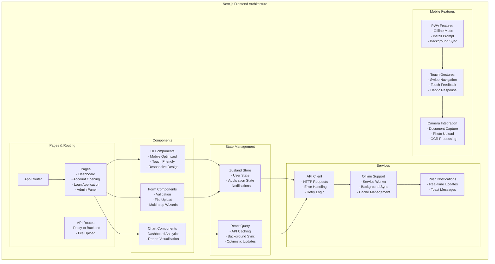
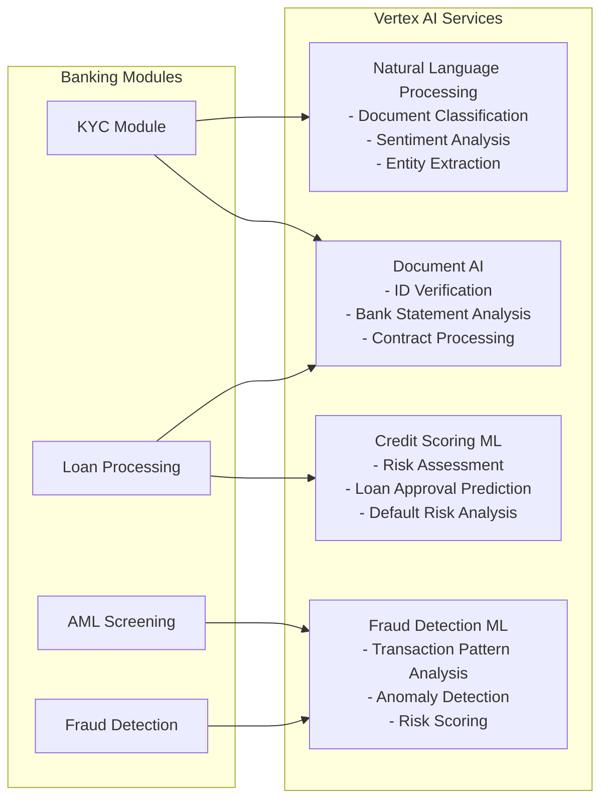
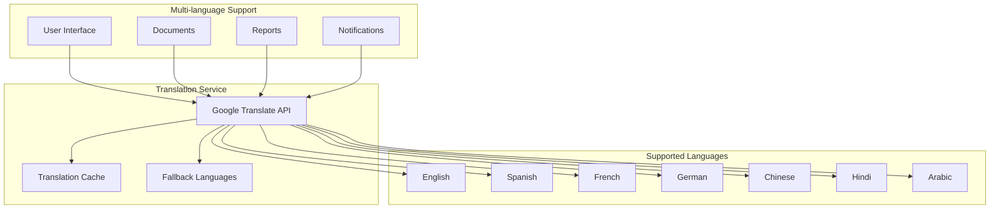
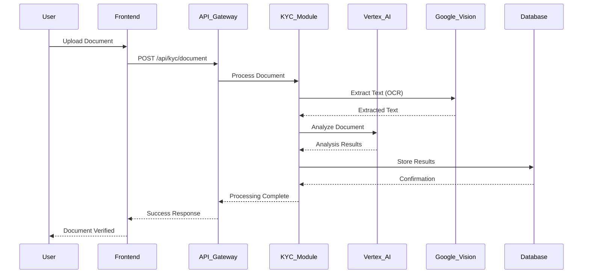
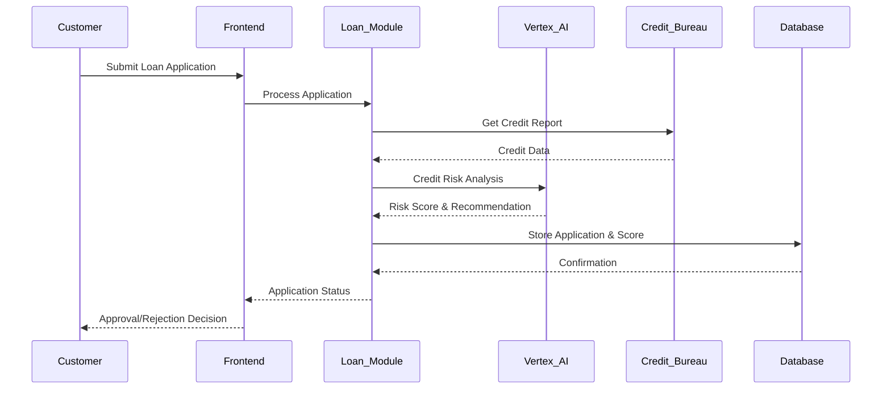
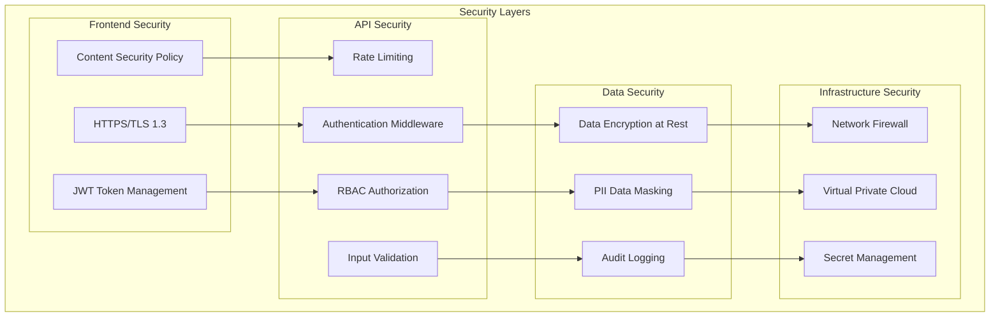
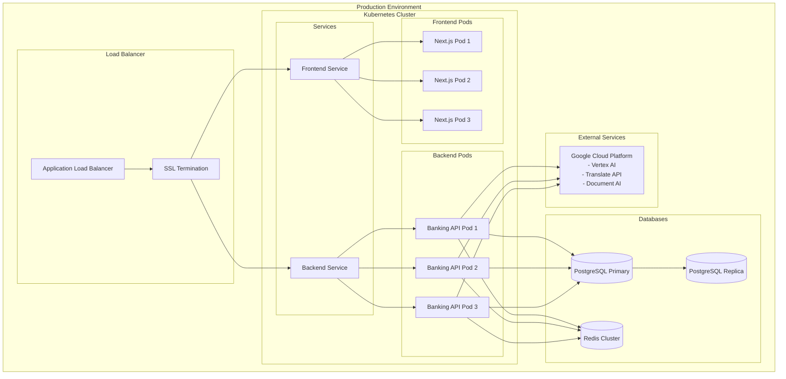

# Banking Process Automation System - Architecture Diagram

## System Architecture Overview

```mermaid
graph TB
    %% External Users
    subgraph "Users"
        U1[Customers]
        U2[Bank Officers]
        U3[Administrators]
    end

    %% Frontend Layer
    subgraph "Frontend Layer"
        FE[Next.js Frontend<br/>Port: 3001]
        PWA[Progressive Web App<br/>Mobile Optimized]
        FE --> PWA
    end

    %% API Gateway & Load Balancer
    subgraph "Gateway Layer"
        LB[Load Balancer]
        AG[API Gateway<br/>Port: 3000]
        RL[Rate Limiter]
        AUTH[Authentication<br/>Middleware]
        
        LB --> AG
        AG --> RL
        AG --> AUTH
    end

    %% Core Backend Services
    subgraph "Core Banking Services"
        subgraph "Authentication Module"
            AS[Auth Service]
            JWT[JWT Manager]
            RBAC[Role-Based Access Control]
        end
        
        subgraph "Banking Modules"
            AO[Account Opening<br/>Module]
            LP[Loan Processing<br/>Module]
            TP[Transaction Processing<br/>Module]
            PP[Payment Processing<br/>Module]
        end
        
        subgraph "Compliance Modules"
            KYC[KYC Module]
            AML[AML Module]
            AUDIT[Audit Module]
        end
    end

    %% Google Cloud AI Services
    subgraph "Google Cloud AI"
        VAI[Vertex AI<br/>Document Analysis<br/>Credit Scoring<br/>Fraud Detection]
        GTRANS[Google Translate API<br/>Multi-language Support]
        GOCR[Document AI<br/>OCR Processing]
        GVISION[Vision AI<br/>Document Verification]
    end

    %% External Services
    subgraph "External Services"
        CB[Credit Bureaus<br/>Experian, Equifax]
        PN[Payment Networks<br/>SWIFT, ACH, RTGS]
        GDB[Government Databases<br/>Identity Verification]
        ES[Email Service<br/>SMTP/Gmail]
    end

    %% Data Layer
    subgraph "Data Layer"
        PG[(PostgreSQL<br/>Primary Database)]
        REDIS[(Redis<br/>Cache & Sessions)]
        FS[File Storage<br/>Documents & Images]
    end

    %% Infrastructure & Monitoring
    subgraph "Infrastructure"
        DOCKER[Docker Containers]
        K8S[Kubernetes<br/>Orchestration]
        MONITOR[Health Monitor]
        CB_PATTERN[Circuit Breaker]
    end

    %% User Connections
    U1 --> FE
    U2 --> FE
    U3 --> FE

    %% Frontend to Gateway
    FE --> LB

    %% Gateway to Services
    AUTH --> AS
    AG --> AO
    AG --> LP
    AG --> TP
    AG --> PP
    AG --> KYC
    AG --> AML
    AG --> AUDIT

    %% AI Service Integrations
    KYC --> VAI
    KYC --> GOCR
    KYC --> GVISION
    LP --> VAI
    AML --> VAI
    FE --> GTRANS
    AO --> GTRANS

    %% External Service Connections
    KYC --> CB
    KYC --> GDB
    PP --> PN
    LP --> CB
    AS --> ES
    AUDIT --> ES

    %% Data Connections
    AS --> PG
    AO --> PG
    LP --> PG
    TP --> PG
    PP --> PG
    KYC --> PG
    AML --> PG
    AUDIT --> PG
    
    AS --> REDIS
    FE --> REDIS
    KYC --> FS
    AO --> FS

    %% Infrastructure Connections
    AG --> MONITOR
    AG --> CB_PATTERN
    
    %% Styling
    classDef frontend fill:#e1f5fe
    classDef backend fill:#f3e5f5
    classDef database fill:#e8f5e8
    classDef external fill:#fff3e0
    classDef ai fill:#e3f2fd
    classDef infra fill:#fce4ec

    class FE,PWA frontend
    class AS,JWT,RBAC,AO,LP,TP,PP,KYC,AML,AUDIT backend
    class PG,REDIS,FS database
    class CB,PN,GDB,ES external
    class VAI,GTRANS,GOCR,GVISION ai
    class DOCKER,K8S,MONITOR,CB_PATTERN infra
```

## Detailed Component Architecture

### Frontend Architecture (Next.js)

## Google Cloud AI Integration Details

### Vertex AI Integration

### Google Translate API Integration

## Data Flow Architecture

### Document Processing Flow

### Loan Application Flow with AI

## Security Architecture

## Deployment Architecture

## Technology Stack Summary

### Frontend Stack
- **Framework**: Next.js 16.1.1 with App Router
- **Styling**: Tailwind CSS 3.4+ with mobile-first design
- **State Management**: Zustand + React Query
- **UI Components**: Headless UI + Custom mobile components
- **Charts**: Chart.js + React Chart.js 2
- **Forms**: React Hook Form with validation
- **PWA**: Service Worker + Background Sync
- **Testing**: Jest + Playwright + Fast-check (Property-based testing)

### Backend Stack
- **Runtime**: Node.js 18+
- **Database**: PostgreSQL 15+ with connection pooling
- **Cache**: Redis 7+ for sessions and caching
- **Authentication**: JWT with role-based access control
- **Email**: SMTP with multiple provider support
- **File Storage**: Local filesystem with cloud storage options
- **Monitoring**: Health checks + Circuit breaker pattern

### AI & External Services
- **Google Vertex AI**: Document analysis, credit scoring, fraud detection
- **Google Translate API**: Multi-language support
- **Google Document AI**: OCR and document processing
- **Google Vision AI**: Image analysis and verification
- **Credit Bureaus**: Experian, Equifax integration
- **Payment Networks**: SWIFT, ACH, RTGS connectivity

### Infrastructure
- **Containerization**: Docker + Docker Compose
- **Orchestration**: Kubernetes with auto-scaling
- **Load Balancing**: Application Load Balancer
- **Security**: TLS 1.3, CSP, Rate limiting, Input validation
- **Monitoring**: Health checks, Circuit breakers, Audit logging

This architecture provides a scalable, secure, and AI-enhanced banking automation platform with comprehensive mobile support and multi-language capabilities.